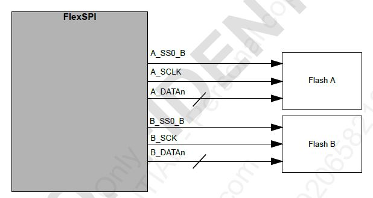
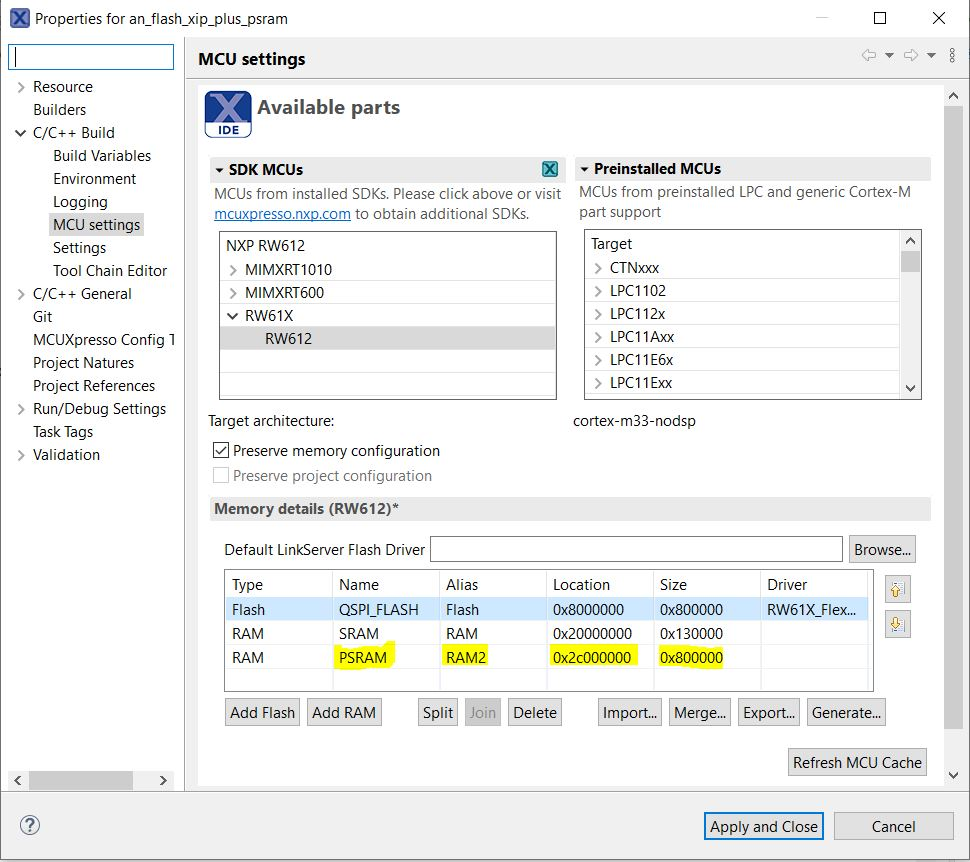
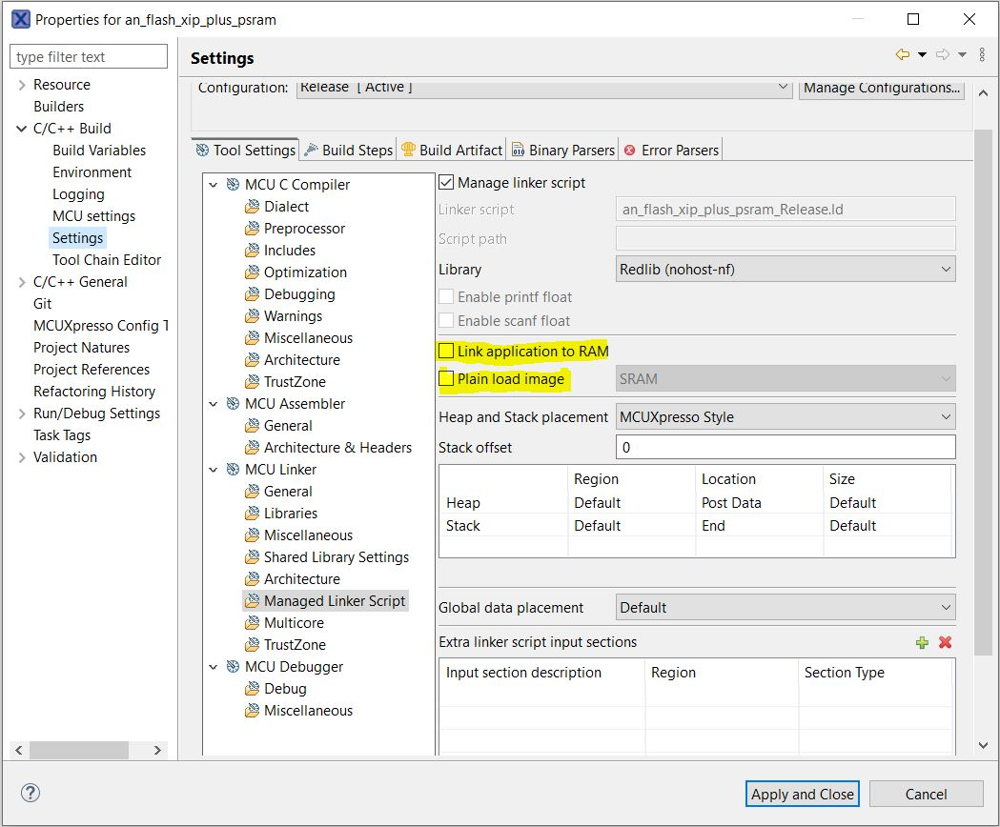
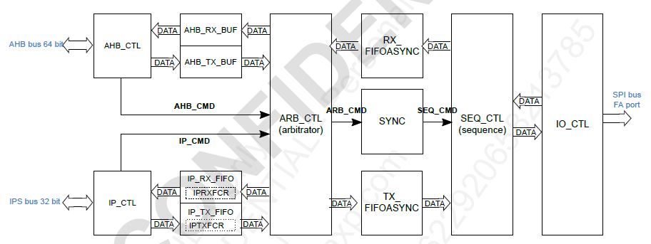
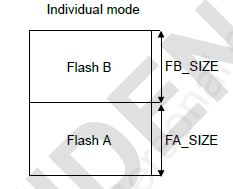
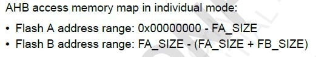

# NXP Application Code Hub

[](https://www.nxp.com)

## XIP from external NOR flash and configuring external pSRAM using multiport FlexSPI module

RW61x has a FlexSPI module with two ports that allows you to connect two QSPI/SPI memories allowing to perform "Execution In-Place (XIP)" from one of them. This application note will guide you step by step how to configure the NOR flash connected to the portA and perform XIP and configure a pSRAM memory connected to the portB and access them through the AHB bus using the cache and the IP bus.



The RW612 does not have internal FLASH memory, so all non-volatile executable code has to be stored in an external memory. The FlexSPI module has the capability to perform "Execution In-Place (XIP)" fetching the code from a memory connected to one of its ports and also handling a sencond memory connected to the other port, a pSRAM memory for this example. The boot ROM is in charge of configuring the FlexSPI for the FLASH device that will perfrom the XIP using the "Flash Configuration Block" (Refer to the section FlexSPI NOR Flash boot from the RW61x UserManual for more details) to fetch the executable image.
**The main challenge of configuring the FlexSPI's 2nd port when the first port performs XIP, is that the FlexSPI module has to be reset to get the new configuration**. This means the code that configures the FlexSPI's 2nd port is being fetched from the external FLASH using the FlexSPI's 1st port but if the module has to be reset, the MCU will lose the code fetch, causing a CPU bus error. To handle this issue, the code that configures, uses or is somehow related with the FlexSPI has to be executed from internal SRAM, so when the FlexSPI module's configuration and reset happens, the MCU will not get lost and can continue the code execution normally.

#### Boards: FRDM-RW612

#### Categories: Memory

#### Peripherals: SPI, FLASH

#### Toolchains: MCUXpresso IDE

## Table of Contents

1. [Software](#step1)
2. [Hardware](#step2)
3. [Setup](#step3)
4. [Results](#step4)
5. [FAQs](#step5)
6. [Support](#step6)
7. [Release Notes](#step7)

## 1. Software<a name="step1"></a>

1. MCU Xpresso IDE v11.9.0 [Build 2144] [2024-01-05] - [MCUXpresso IDE](https://nxp.com/mcuxpresso)
2. FRDM-RW612 SDK 2.16.000 - [SDK Builder](https://mcuxpresso.nxp.com)

## 2. Hardware<a name="step2"></a>

1. FDRM-RW612

## 3. Setup<a name="step3"></a>

### 3.1 Step 1 - Compiler Configuration and Code Relocation

As explained in the introduction, all the code related to the FlexSPI has to be recolated to be executed from internal SRAM. To do this, there are 2 strategies used in this example. **The 1st strategy** consist to use a set of linker patch files to set a full file/module to be executed from SRAM as shown:


[main_data.ldt](an_flash_xip_plus_psram/linkscripts/main_data.ldt): This file tells the compiler to place code part (.text) from these specific modules within the data zone, in this case, the SRAM.

```typescript
<#if memory.name=="SRAM">
       *fsl_flexspi.o (.text*)
       *fsl_clock.o (.text*)
       *clock_config.o (.text*)
       *fsl_reset.o (.text*)
       *fsl_debug_console.o (.text*)
       *fsl_cache.o (.text*)
</#if>
       *(.data*)
```

[main_text.ldt](an_flash_xip_plus_psram/linkscripts/main_text.ldt): This file tells the compiler to exclude the code part (.text) from these specific modues from the code zone, in this case FLASH.

```typescript
*(EXCLUDE_FILE(*fsl_flexspi.o *fsl_clock.o *clock_config.o *fsl_reset.o *fsl_debug_console.o *fsl_cache.o) .text*)
```

[noinit_noload_section.ldt](an_flash_xip_plus_psram/linkscripts/noinit_noload_section.ldt): This file sets the the section for the non-initialized data in the SRAM.

```typescript
/* DEFAULT NOINIT SECTION */
    .noinit (NOLOAD): ALIGN(4)
    {
        _noinit = .;
        PROVIDE(__start_noinit_RAM = .) ;
        PROVIDE(__start_noinit_SRAM = .) ;
        *(.noinit*)
        . = ALIGN(4) ;
        _end_noinit = .;
        PROVIDE(__end_noinit_RAM = .) ;
        PROVIDE(__end_noinit_SRAM = .) ;
    } > SRAM AT> SRAM
```

**The 2nd strategy** consists to set specific functions (not a full file/module) to be executed from SRAM. To do this, the file must include a library with some macros that helps to place code or data in specific zones from the memory map. This is an example on how the function "Example_Routine" is forced to be executed from SRAM using the macro "__RAMFUNC(SRAM)" as prefix. Please notice the following routine does not exist in the code, it is just to demonstrate the concept:

```c
#include <cr_section_macros.h>
__RAMFUNC(SRAM) uint32_t Example_Routine(void)
{
  .....
  .....
}
```

Once is decided which modules/files and routines have to be executed from SRAM using these strategies, the user must set the memory zones in the project. Since this example is intended to use an external pSRAM connected to the 2nd port of the FlexSPI module, this memory section has to be defined. The FRDM-RW612 board has the APS6404L-3SQN pSRAM memory which is 8 MBytes size, the location in the memory map will be explained later:



Also you need to make sure your project is not configured to execute all the code from SRAM since the main goal is execute code from external FLASH. Make sure the following check boxes are unchecked in the project configuration as follows:



### 3.2 Step 2 - pSRAM configuration with FLASH Coexistence

This code example is based on the SDK's project named "flexspi_psram_polling_transfer". In the original SDK project, all the code is built to be loaded and executed from internal SRAM due the coexistance problem explained at the introduction, also the intention is just to show how to configure and handle the pSRAM connected to board. In this example the intention is to have both memories, NOR FLASH and pSRAM configured and working together.

We will use the function "BOARD_InitPsRam" defined at [board.c](an_flash_xip_plus_psram/board/board.c) to configure the coexistence with the 2 memories and set it to be executed from internal SRAM. The coexistance configuration includes: Set the flash configuration structure, initialize FlexSPI' ports A and B, configure the Look Up Table (LUT) to keep commands for both memories, reset and ID read to the pSRAM, Cache regions and policies for both memories. We will only cover the code changes within this function.

* "BOARD_InitPsRam" routine relocation to be executed from internal SRAM:

```c
#include <cr_section_macros.h>
__RAMFUNC(SRAM) status_t BOARD_InitPsRam(void)
{
  .....
  .....
}
```

* Set configuration structure for the NOR FLASH device that performs XIP. You must be careful with the parameter "flashSize" since it has to be defined in KBytes. The FRDM-RW612 board has NOR FLASH of 512Mbits = 64MBytes = 0x10000 KBytes. Also notice the AWRSeqIndex (wirte command) and ARDSeqIndex (read command), their values are the positions configured by the ROM for the LUT register. Since we are reconfiguring the FlexSPI module, we will keep the same commands positions used by the ROM at boot. If you wan't to check the full NOR FLASH LUT, see the file [flash_config.c](an_flash_xip_plus_psram/flash_config/flash_config.c)

```c
flexspi_device_config_t flashConfig = {
	    .flexspiRootClk       = 106666667U,
	    .flashSize            = 0x10000, /* 512Mb/Kbyte */
	    .CSIntervalUnit       = kFLEXSPI_CsIntervalUnit1SckCycle,
	    .CSInterval           = 2,
	    .CSHoldTime           = 3,
	    .CSSetupTime          = 3,
	    .dataValidTime        = 2,
	    .columnspace          = 0,
	    .enableWordAddress    = 0,
	    .AWRSeqIndex          = 9,
	    .AWRSeqNumber         = 1,
	    .ARDSeqIndex          = 0,
	    .ARDSeqNumber         = 1,
	    .AHBWriteWaitUnit     = kFLEXSPI_AhbWriteWaitUnit2AhbCycle,
	    .AHBWriteWaitInterval = 0,
	};
```

* Configure the pSRAM LUT that contains the commands Read, Write, Reset, Reset Enable and Read ID. When setting this LUT we must be careful not to overwrite the FLASH LUT configured by the ROM at boot, so we will **add an offset** to the pSRAM LUT when calling the "FLEXSPI\_UpdateLUT" routine. The LUT register is 256Bytes size, each entry in the LUT is 4Bytes and ech command can be composed of 16Bytes, this means the FlexSPI can handle up to 16 commands. These commands have to be shared between the NOR FLASH and the pSRAM. For this example the pSRAM commands starts at index 11 using the offset 44 when configuring its LUT. You can see the AWRSeqIndex (wirte command) and ARDSeqIndex (read command) indexes used in the pSRAM's configuration structure.

```c
flexspi_device_config_t psramConfig = {
        .flexspiRootClk       = 106666667U, /* 106MHZ SPI serial clock */
        .isSck2Enabled        = false,
        .flashSize            = 0x2000,    /* 64Mb/KByte */
        .addressShift         = false,
        .CSIntervalUnit       = kFLEXSPI_CsIntervalUnit1SckCycle,
        .CSInterval           = 0,
        .CSHoldTime           = 3,
        .CSSetupTime          = 3,
        .dataValidTime        = 1,
        .columnspace          = 0,
        .enableWordAddress    = false,
        .AWRSeqIndex          = 12,
        .AWRSeqNumber         = 1,
        .ARDSeqIndex          = 11,
        .ARDSeqNumber         = 1,
        .AHBWriteWaitUnit     = kFLEXSPI_AhbWriteWaitUnit2AhbCycle,
        .AHBWriteWaitInterval = 0,
        .enableWriteMask      = true,
};

uint32_t psramLUT[20] = {
        /* Read Data */
        [0] = FLEXSPI_LUT_SEQ(kFLEXSPI_Command_SDR, kFLEXSPI_1PAD, 0xEB, kFLEXSPI_Command_RADDR_SDR, kFLEXSPI_4PAD, 0x18),
        [1] = FLEXSPI_LUT_SEQ(kFLEXSPI_Command_DUMMY_SDR, kFLEXSPI_4PAD, 6, kFLEXSPI_Command_READ_SDR, kFLEXSPI_4PAD, 0x04),

        /* Write Data */
        [4] = FLEXSPI_LUT_SEQ(kFLEXSPI_Command_SDR, kFLEXSPI_1PAD, 0x38, kFLEXSPI_Command_RADDR_SDR, kFLEXSPI_4PAD, 0x18),
        [5] = FLEXSPI_LUT_SEQ(kFLEXSPI_Command_WRITE_SDR, kFLEXSPI_4PAD, 0x00, kFLEXSPI_Command_STOP, kFLEXSPI_1PAD, 0x00),

        /* Reset Enable */
        [8] = FLEXSPI_LUT_SEQ(kFLEXSPI_Command_SDR, kFLEXSPI_1PAD, 0x66, kFLEXSPI_Command_STOP, kFLEXSPI_1PAD, 0x00),

        /* Reset */
        [12] = FLEXSPI_LUT_SEQ(kFLEXSPI_Command_SDR, kFLEXSPI_1PAD, 0x99, kFLEXSPI_Command_STOP, kFLEXSPI_1PAD, 0x00),

       /* Read ID */
        [16] = FLEXSPI_LUT_SEQ(kFLEXSPI_Command_SDR, kFLEXSPI_1PAD, 0x9F, kFLEXSPI_Command_RADDR_SDR, kFLEXSPI_1PAD, 0x18),
        [17] = FLEXSPI_LUT_SEQ(kFLEXSPI_Command_READ_SDR, kFLEXSPI_1PAD, 0x08, kFLEXSPI_Command_STOP, kFLEXSPI_1PAD, 0),
    };
```

```c
FLEXSPI_Init(BOARD_FLEXSPI_PSRAM, &config);

/* Configure flash settings according to serial flash feature. */
FLEXSPI_SetFlashConfig(BOARD_FLEXSPI_PSRAM, &flashConfig, kFLEXSPI_PortA1);

/* Configure flash settings according to serial flash feature. */
FLEXSPI_SetFlashConfig(BOARD_FLEXSPI_PSRAM, &psramConfig, kFLEXSPI_PortB1);

/* Update bottom LUT table (44-63). */
FLEXSPI_UpdateLUT(BOARD_FLEXSPI_PSRAM, 44U, psramLUT, ARRAY_SIZE(psramLUT));
```

* After the LUTs, FlexSPI ports and module are configured, we will test if the pSRAM is working properly performing the reset sequence and reading the ID. The ID value must be 0x5DXX where the 5D indicates the die is correct and the XX is the manufacturing ID and may vary. Check the APS6404L datasheet for more details.

```c
/* Reset PSRAM */
status = flexspi_hyper_ram_run_seq(BOARD_FLEXSPI_PSRAM, 13U);
if (status == kStatus_Success)
{
    status = flexspi_hyper_ram_run_seq(BOARD_FLEXSPI_PSRAM, 14U);
}
if (status != kStatus_Success)
{
    status = kStatus_Fail;
    break;
}
  
uint16_t id;
status = flexspi_hyper_ram_read_id(BOARD_FLEXSPI_PSRAM, (uint32_t*)&id);
if (status != kStatus_Success)
{
    status = kStatus_Fail;
    break;
}
PRINTF("pSRAM initialized with ID: %x\r\n",id);
```

* If the pSRAM is working properly we'll proceed to configugure the cache zones and policies. Since the FRDM-RW612 board has a NOR FLASH of 64MBytes and a pSRAM of 8MBytes, the first zone will cover the FLASH size and the second zone will cover the pSRAM size. The cache policies are specific for each zone configured. For more details, review the RW612 UserManual chapters 10 & 11 related to the cache.

```c
cacheCfg.boundaryAddr[0] = 0x4000000; // flash size Bytes
cacheCfg.boundaryAddr[1] = 0x4800000; // flash + psram size Bytes
cacheCfg.policy[0] = kCACHE64_PolicyWriteThrough; // flash
cacheCfg.policy[1] = kCACHE64_PolicyWriteThrough; // psram
```

### 3.3 Step 3 - Memories Addressing

The FlexSPI modue can address both ports through 2 different data buses. These are the IP bus and the AHB bus as shown in the module's block diagram:



The AHB bus access is controlled by the cache while the IP bus acces is controlled directly by the FlexSPI module. Normally the read/write data commands are issued through the AHB bus and the specific commands like resets and read/write to memory configuration registers are issued through the IP bus, but this last one is not limited to such commands only, you can issue read/write data commands as well.

The FlexSPI module does not have any register or any configuration to issue a command to a specific memory other than the memory map configured where the Port A has precedence to the Port B. This means if you want to issue a command to the pSRAM you need to **set the FLASH size as offset** to the pSRAM address you want read/write.





This is defined in the RW612 UserManual chaprter "12.2.4 AHB access memory map", however this same concept applies to the IP bus.

You can see how to address the pSRAM via IP Bus in the example code when issuing the reset and the read ID commands at [board.c](an_flash_xip_plus_psram/board/board.c), where the routines checks if there is a memory size configured in the port A. If so, then the size configured is added as an offet to the address of the pSRAM at port B.

```c
static status_t flexspi_hyper_ram_read_id(FLEXSPI_Type *base, uint32_t *buffer)
{
    .......
    .......

    /* Write data */
    if(base->FLSHCR0[0] != 0){
        /*If portA1 memory size is configured, then add the size to the portB address*/
        flashXfer.deviceAddress = (0 + (base->FLSHCR0[0] * 1024));
    }else{
    	/*If portA1 memory not configured, then no change to the address*/
        flashXfer.deviceAddress = 0;
    }

    .......
    .......
}
```

To handle the addessing through the AHB Bus, you need to access the memories through the cache address space. The chapter 10.1 "FlexSPI Cache" defines two cache address spaces for each one of the FlexSPI ports. The address space for the portA goes from 0x08000000 to 0x20000000 and the address space for the portB goes from 0x28000000~0x40000000. However this can be confusing due this address spaces only applies when you have only one of the ports configured, not both. If both ports are configured, just like this example, you need to add the the PortA size configured as offset to handle any address to the PortB address space, very similar as done for the IP bus. For this code example, the start of address space for the PortB (pSRAM) must be defined as 0x28000000 + PortA size = 0x28000000 + 64MBytes = 0x2C000000. See this at [flexspi_xip_nor_plus_psram_ip_ahb.c](an_flash_xip_plus_psram/source/flexspi_xip_nor_plus_psram_ip_ahb.c) source file.

```c
#define PSRAM_CACHE_START_ADDR             0x2C000000U
#define PSRAM_CACHE_END_ADDR               0x2C800000U
```

## 4. Results <a name="step4"></a>

This code example perform 3 main tests to the PortB device performing XIP from PortA. See the tests at [flexspi_xip_nor_plus_psram_ip_ahb.c](an_flash_xip_plus_psram/source/flexspi_xip_nor_plus_psram_ip_ahb.c) source file.

* Read/Write to all pSRAM memory address range through the IP Bus: This test uses IP routines for read and write to the pSRAM memory. At first writes 0xFFFFFFFF's to all memory range (8MBytes), then writes an incremental number from 0-0x1FFFFF to cover all memory ranges and then reads and compares if the incremental number matches agins what is written. If the comparation fails, the address, the read value and the expected value are reported as a failure in the test. If all the numbers match, then you will get a serial message "IP Test completed!"

  ```c
  void psram_ip_test(void)
  {
    .....
    .....
  }
  ```
* Read/Write to all pSRAM memory address range through the AHB Bus: This test uses the PortB cache address space to access the pSRAM memory. At first writes 0xFFFFFFFF's to all memory range (8MBytes) directly through , then writes an incremental number from 0-0x1FFFFF to cover all memory ranges and then reads and compares if the incremental number matches agins what is written. If the comparation fails, the address, the read value and the expected value are reported as a failure in the test. If all the numbers match, then you will get a serial message "AHB Test completed!"

  ```c
  void psram_ahb_test(void)
  {
    .....
    .....
  }
  ```
* Read/Write to a non-init buffer allocated at pSRAM address space: The code example defines a 4KByte buffer that will be allocated in the pSRAM cache address space by the linker. The test first checks the address of the buffer to verify if it was allocated in the right address space. If the buffer is allocated between 0x2C000000 to 0x2C800000 address, you will get a serial message "pSRAM buffer right allocated at cache zone:" with the address of the buffer, then the test continues, if not, the test fails and you will get a serial message "pSRAM buffer not right allocated at cache zone:" with the address of the buffer. The second phase of the test a pattern "0xAABBCCDD" is written at index 0 and it is decremented trhough the index 1024. The test will read all the data in the buffer and compares it agains to was written. If the test fails, the index, the read data and the expected data will be reported. If the test passed you will get a serial message "pSRAM buffer writing succeeded in all range".

  ```c
  #define PSRAM_BUFFER_SIZE                  1024U
  #define PSRAM_CACHE_START_ADDR             0x2C000000U
  #define PSRAM_CACHE_END_ADDR               0x2C800000U

  static __NOINIT(PSRAM) uint32_t psram_nonInit_buffer[PSRAM_BUFFER_SIZE];

  void psram_nonInit_buffer_test(void)
  {
    .....
    .....
  }
  ```

## 5. FAQs<a name="step5"></a>

1. How can I see the application's output messages?
   * The output messages are sent through a serial interface. Using the Window's device manager, check for the COM number assigned to the MCULink interface embbedded in the FRDM-RW612 board, then open and configure a serial monitor at 115200 kbps, 1 stop bit, no parity. You will be able to see the output messages when running the application.

## 6. Support<a name="step6"></a>

*Provide URLs for help here.*

#### Project Metadata

<!----- Boards ----->

[](https://github.com/search?q=org%3Anxp-appcodehub+FRDM-RW612+in%3Areadme&type=Repositories)

<!----- Categories ----->

[](https://github.com/search?q=org%3Anxp-appcodehub+memory+in%3Areadme&type=Repositories)

<!----- Peripherals ----->

[](https://github.com/search?q=org%3Anxp-appcodehub+spi+in%3Areadme&type=Repositories) [](https://github.com/search?q=org%3Anxp-appcodehub+flash+in%3Areadme&type=Repositories)

<!----- Toolchains ----->

[](https://github.com/search?q=org%3Anxp-appcodehub+mcux+in%3Areadme&type=Repositories)

Questions regarding the content/correctness of this example can be entered as Issues within this GitHub repository.

> **Warning**: For more general technical questions regarding NXP Microcontrollers and the difference in expected funcionality, enter your questions on the [NXP Community Forum](https://community.nxp.com/)

[](https://www.youtube.com/@NXP_Semiconductors)
[](https://www.linkedin.com/company/nxp-semiconductors)
[](https://www.facebook.com/nxpsemi/)
[](https://twitter.com/NXP)

## 7. Release Notes<a name="step7"></a>


| Version | Description / Update                    |                Date |
| :-----: | --------------------------------------- | ------------------: |
|   1.0   | Initial release on Application Code Hub | September 17th 2024 |
